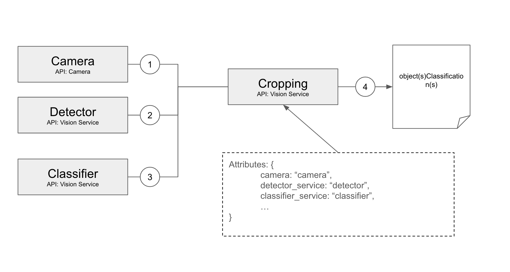

# Viam Detect and Classify Vision Service

This repository contains the `visionsvc` package, a module of the Viam vision service designed for image cropping and further analysis. It integrates several vision services, including object detection, age classification, and gender classification.

Available via the [Viam Registry](https://app.viam.com/module/viam-soleng/detect-and-classify)! -> Currently for darwin/arm64 and android/arm64 others will follow soon.

## Description

The Viam Detect and Classify Vision Service (`visionsvc`) is a specialized module within the Viam vision framework. Its primary function is to crop an image to an initial detection and then utilize a classifier model to return accurate classifications such as detect a face and classify age and gender.



## Features

- Takes a camera as input
- Uses an object detector to identify the objects bounding boxes
- Crops the detected images according to their bounding boxes
- Feeds the cropped images into the configured classifier for more accurate results
- Returns the classification labels and score

## Configuration and Dependencies

Dependencies are implicit.

Sample Configuration Attributes:
```json
{
  "camera": "camera",
  "detector_service": "detector",
  "detector_confidence": 0.5,
  "max_detections": 5,
  "detector_valid_labels": [
    "label"
  ],
  "classifier_service": "classifier",
  "max_classifications": 5,
  "log_image": false,             //Optional
  "image_path": "<- YOUR PATH ->" //Optional
}
```

Sample Service Configuration:
```json
    {
      "name": "detect-and-classify",
      "type": "vision",
      "namespace": "rdk",
      "model": "viam-soleng:vision:detect-and-classify",
      "attributes": {
        "classifier_service": "vision-age",
        "max_detections": 5,
        "image_path": "/Users/username/faces/",
        "detector_confidence": 0.7,
        "detector_valid_labels": [
          "face"
        ],
        "camera": "cam",
        "detector_service": "vision-face",
        "max_classifications": 5,
        "log_image": false
      }
    }
```
